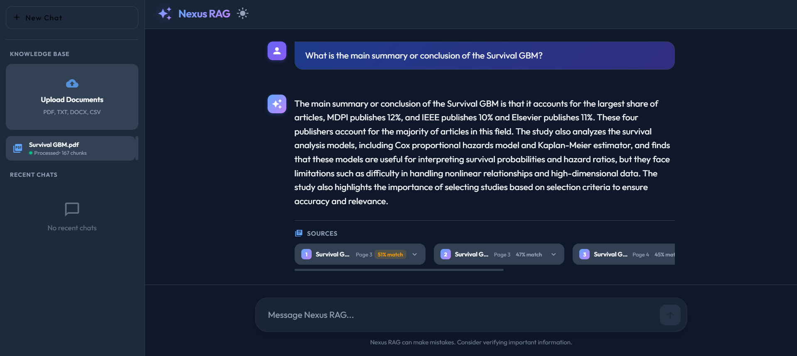

# Nexus RAG — Full-Stack AI RAG Application

A Full-Stack Retrieval-Augmented Generation (RAG) application that lets you upload documents (PDF, DOCX, TXT, CSV) and chat with them using AI. Built with Angular 18, FastAPI, LangChain, FAISS, and Ollama.



## Tech Stack

### Frontend
- **Angular 18** — Standalone components
- **Angular Material** — UI components (icons, buttons, tooltips)
- **TypeScript**
- **CSS** — Custom styling with CSS variables, glassmorphism, dark/light theme

### Backend
- **Python 3** with **FastAPI** — REST API with SSE streaming
- **LangChain** — RAG pipeline orchestration
- **FAISS** — Vector store for document embeddings
- **Sentence-Transformers** (`all-MiniLM-L6-v2`) — Embedding model
- **Ollama** (`tinyllama`) — Local LLM for generating answers
- **PyPDF2 / pdfplumber** — PDF text extraction
- **python-docx** — DOCX text extraction
- **Pandas** — CSV/XLSX processing
- **Uvicorn** — ASGI server

## Features

- Upload PDF, TXT, DOCX, CSV files and process them into chunks
- Semantic search using FAISS vector similarity
- Real-time streaming chat responses (Server-Sent Events)
- Source citations with page numbers and match scores
- Chat history with session management
- Dark and Light theme toggle
- New Chat / Delete Chat functionality
- Stop button to cancel AI response generation

## Project Structure

```
RAG APP/
├── backend/
│   ├── app/
│   │   ├── api/routes/       # chat, upload, documents, history, health endpoints
│   │   ├── core/             # logging, security
│   │   ├── models/           # Pydantic schemas
│   │   ├── rag/              # chunker, embeddings, llm_provider, pipeline, prompts, retriever, vectorstore
│   │   ├── services/         # chat_service, document_service, file_processor
│   │   └── utils/            # file and text utilities
│   ├── requirements.txt
│   └── run.py
├── frontend/
│   └── src/app/
│       ├── components/       # chat, file-upload, header, sidebar, source-card
│       ├── models/           # TypeScript interfaces
│       ├── pipes/            # markdown pipe
│       └── services/         # chat, upload, theme services
├── .env                      # environment config (not uploaded)
├── docker-compose.yml
└── README.md
```

## Setup

### Prerequisites
- Node.js v20+
- Python 3.8+
- Ollama installed and running

### Backend
```bash
cd backend
python -m venv venv

# Windows
venv\Scripts\activate

pip install -r requirements.txt
python run.py
```

### Frontend
```bash
cd frontend
npm install
npm start
```

### Ollama
```bash
ollama pull tinyllama
```

### Access
- Frontend: `http://localhost:4200`
- Backend API: `http://localhost:8000/docs`

## API Endpoints

| Method | Endpoint | Description |
|--------|----------|-------------|
| POST | `/api/upload` | Upload a document |
| POST | `/api/chat` | Chat with documents (SSE streaming) |
| GET | `/api/documents` | List uploaded documents |
| DELETE | `/api/documents` | Delete a document |
| GET | `/api/history` | Get chat sessions |
| GET | `/api/health` | Health check |
