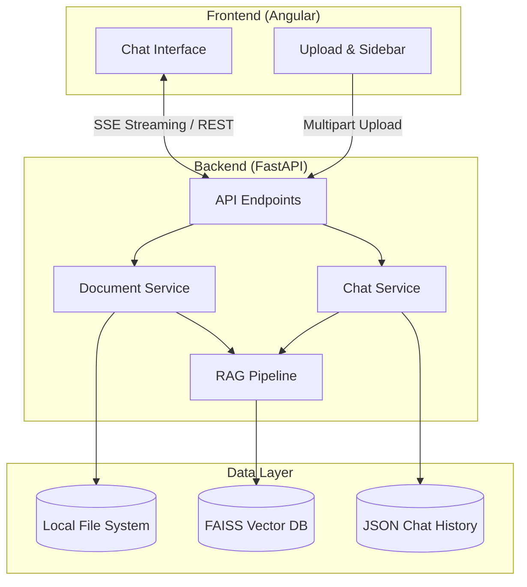

# Nexus RAG — Enterprise Retrieval-Augmented Generation

A production-ready Full-Stack RAG (Retrieval-Augmented Generation) application featuring an Angular 18+ Material frontend, FastAPI backend, and LangChain AI pipeline.

## 🌟 Features

- **Multi-Format Ingestion**: Upload PDF, TXT, DOCX, CSV, and XLSX files.
- **Intelligent Processing**: PyPDF2, pdfplumber, python-docx, and Pandas integration.
- **Real-Time Streaming**: ChatGPT-style SSE token streaming.
- **Source Citations**: Accurate transparency showing exact document sources and match scores.
- **Conversation Memory**: Persistent chat history across sessions.
- **LLM Agnostic**: Switch seamlessly between OpenAI GPT and local Ollama models.
- **Modern UI**: Angular Material, Glassmorphism, Dark/Light modes, and Responsive Design.
- **Production Ready**: Docker Compose, async processing, robust error handling.

## 🏗 Architecture



## 🚀 Quick Start (Docker)

The easiest way to run the application is using Docker Compose.

1. **Clone the repository**
2. **Configure Environment**
   Open `.env` and set `LLM_PROVIDER`:
   - For Local (free): `LLM_PROVIDER=ollama` (requires running an Ollama instance)
   - For OpenAI: `LLM_PROVIDER=openai` and `OPENAI_API_KEY=sk-...`

3. **Start the application**
   ```bash
   docker-compose up --build
   ```

4. **Access the application**
   - Frontend: `http://localhost:4200`
   - Backend API Docs: `http://localhost:8000/docs`

## 💻 Manual Setup

If you prefer to run it manually without Docker:

### Prerequisites
- Node.js v20+
- Python 3.9+ (3.10 or 3.11 recommended)

### Backend Setup
```bash
cd backend
python -m venv venv

# Windows
venv\Scripts\activate
# Mac/Linux
source venv/bin/activate

pip install -r requirements.txt
python run.py
```

### Frontend Setup
```bash
cd frontend
npm install
npm start
```

## 📚 Supported Formats

| Format | Processor | Description |
|--------|-----------|-------------|
| **PDF** | PyPDF2 / pdfplumber | Extracts text page by page. Fallback to pdfplumber for complex layouts. |
| **DOCX**| python-docx | Extracts paragraphs and table contents. |
| **TXT** | standard IO | Multi-encoding support (UTF-8, Latin-1). |
| **CSV** | Pandas | Converts rows into natural language (e.g., "Col1: Val1, Col2: Val2") for semantic search. |
| **XLSX**| Pandas / openpyxl | Processes multiple sheets and converts to natural language. |

## 🛠 API Documentation

Once the backend is running, visit `http://localhost:8000/docs` for the interactive Swagger UI.

Key endpoints:
- `POST /api/upload`: Upload multipart files
- `POST /api/chat`: SSE streaming endpoint for RAG chat
- `GET /api/documents`: List ingested documents
- `DELETE /api/documents`: Delete a document and its embeddings
- `GET /api/history`: Retrieve chat sessions

## 🔧 Future Improvements

- Add ChromaDB/Pinecone support as alternatives to FAISS.
- Add PostgreSQL/MongoDB for robust chat history (currently uses JSON files).
- Add Tesseract OCR for scanned PDF support.
- Implement User Authentication (JWT).
- Add Hybrid Search (BM25 + Dense Vectors) for better keyword matching.
